## Лабораторная работа 10
# test_stack
```
import csv

import pytest

from src.lab08.models import Student
from src.lab09.models import Group

STUDENTS = [
    {
        "fio": "Межеровская Анна Сергеевна",
        "birthdate": "2007-11-04",
        "group": "BIVT-25-4",
        "gpa": 0.01,
    },
    {
        "fio": "Кабанова Амалия Сергеевна",
        "birthdate": "2009-01-18",
        "group": "BIVT-25-4",
        "gpa": 5.0,
    },
    {
        "fio": "Муфазалов Эрик Мансурович",
        "birthdate": "2007-08-28",
        "group": "BIVT-25-4",
        "gpa": 5.0,
    },
]
```
# test_queue
```python
import pytest

from src.lab10.structures import Queue


def test_queue_initially_empty():
    q = Queue()
    assert q.is_empty()
    assert len(q) == 0
    assert q.peek() is None


def test_queue_enqueue_dequeue_fifo():
    q = Queue()
    q.enqueue(1)
    q.enqueue(2)
    q.enqueue(3)

    assert len(q) == 3
    assert q.dequeue() == 1
    assert q.dequeue() == 2
    assert q.dequeue() == 3
    assert q.is_empty()


def test_queue_peek_does_not_remove():
    q = Queue()
    q.enqueue("x")
    assert q.peek() == "x"
    assert len(q) == 1


def test_queue_dequeue_empty_raises():
    q = Queue()
    with pytest.raises(IndexError):
        q.dequeue()
```
# test_linked_list
```python
import pytest

from src.lab10.linked_list import SinglyLinkedList


def test_empty_list():
    lst = SinglyLinkedList()
    assert len(lst) == 0
    assert list(lst) == []
    assert lst.head is None
    assert lst.tail is None


def test_append():
    lst = SinglyLinkedList()
    lst.append(1)
    lst.append(2)
    lst.append(3)

    assert list(lst) == [1, 2, 3]
    assert len(lst) == 3
    assert lst.head.value == 1
    assert lst.tail.value == 3


def test_prepend():
    lst = SinglyLinkedList()
    lst.prepend(1)
    lst.prepend(2)
    lst.prepend(3)

    assert list(lst) == [3, 2, 1]
    assert len(lst) == 3
    assert lst.head.value == 3
    assert lst.tail.value == 1


def test_insert_middle():
    lst = SinglyLinkedList()
    lst.append(1)
    lst.append(3)
    lst.insert(1, 2)

    assert list(lst) == [1, 2, 3]
    assert len(lst) == 3


def test_insert_at_begin_and_end():
    lst = SinglyLinkedList()
    lst.insert(0, "a")
    lst.insert(1, "c")
    lst.insert(1, "b")

    assert list(lst) == ["a", "b", "c"]


def test_insert_out_of_range():
    lst = SinglyLinkedList()
    with pytest.raises(IndexError):
        lst.insert(1, "x")


def test_remove_at_middle():
    lst = SinglyLinkedList()
    for i in range(5):
        lst.append(i)

    lst.remove_at(2)
    assert list(lst) == [0, 1, 3, 4]
    assert len(lst) == 4


def test_remove_at_head():
    lst = SinglyLinkedList()
    lst.append(1)
    lst.append(2)

    lst.remove_at(0)
    assert list(lst) == [2]
    assert lst.head.value == 2
    assert lst.tail.value == 2


def test_remove_at_tail():
    lst = SinglyLinkedList()
    lst.append(1)
    lst.append(2)
    lst.append(3)

    lst.remove_at(2)
    assert list(lst) == [1, 2]
    assert lst.tail.value == 2


def test_remove_single_element():
    lst = SinglyLinkedList()
    lst.append(42)

    lst.remove_at(0)
    assert len(lst) == 0
    assert lst.head is None
    assert lst.tail is None


def test_remove_out_of_range():
    lst = SinglyLinkedList()
    with pytest.raises(IndexError):
        lst.remove_at(0)


def test_repr_and_pretty():
    lst = SinglyLinkedList()
    lst.append("A")
    lst.append("B")

    assert repr(lst) == "SinglyLinkedList(['A', 'B'])"
    assert lst.pretty() == "[A] -> [B] -> None"
```
# linked-list
```python
class Node:
    def __init__(self, value, next=None) -> None:
        self.value = value
        self.next = next


class SinglyLinkedList:
    def __init__(self) -> None:
        self.head = None
        self.tail = None
        self._size = 0

    def append(self, value) -> None:
        new = Node(value)
        if self.head is None:
            self.head = self.tail = new
        else:
            assert self.tail is not None
            self.tail.next = new
            self.tail = new
        self._size += 1

    def prepend(self, value) -> None:
        new = Node(value, next=self.head)
        self.head = new
        if self.tail is None:
            self.tail = new
        self._size += 1
    def insert(self, idx: int, value) -> None:
        if not (0 <= idx <= self._size):
            raise IndexError("index out of range")

        if idx == 0:
            return self.prepend(value)

        if idx == self._size:
            return self.append(value)

        prev = self.head
        for _ in range(idx - 1):
            assert prev is not None
            prev = prev.next

        new = Node(value, next=prev.next)
        prev.next = new
        self._size += 1

    def remove_at(self, idx: int) -> None:
        if not (0 <= idx < self._size):
            raise IndexError("index out of range")

        if idx == 0:
            removed = self.head
            self.head = removed.next
            if self._size == 1:
                self.tail = None
            self._size -= 1
            return

        prev = self.head
        for _ in range(idx - 1):
            prev = prev.next

        removed = prev.next
        prev.next = removed.next
        if removed is self.tail:
            self.tail = prev

        self._size -= 1

    def __iter__(self):
        current = self.head
        while current:
            yield current.value
            current = current.next

    def __len__(self) -> int:
        return self._size

    def __repr__(self) -> str:
        return f"SinglyLinkedList([{', '.join(repr(v) for v in self)}])"

    def pretty(self) -> str:
        parts = []
        current = self.head
        while current:
            parts.append(f"[{current.value}]")
            current = current.next
        parts.append("None")
        return " -> ".join(parts)
```
# structures
```python
from collections import deque


class Stack:
    def __init__(self) -> None:
        self._data = []

    def push(self, item) -> None:
        self._data.append(item)

    def pop(self):
        if not self._data:
            raise IndexError("pop from empty Stack")
        return self._data.pop()

    def peek(self):
        return self._data[-1] if self._data else None

    def is_empty(self) -> bool:
        return not self._data

    def __len__(self) -> int:
        return len(self._data)


class Queue:
    def __init__(self) -> None:
        self._data = deque()

    def enqueue(self, item) -> None:
        self._data.append(item)

    def dequeue(self):
        if not self._data:
            raise IndexError("dequeue from empty Queue")
        return self._data.popleft()

    def peek(self):
        return self._data[0] if self._data else None

    def is_empty(self) -> bool:
        return not self._data

    def __len__(self) -> int:
        return len(self._data)
```
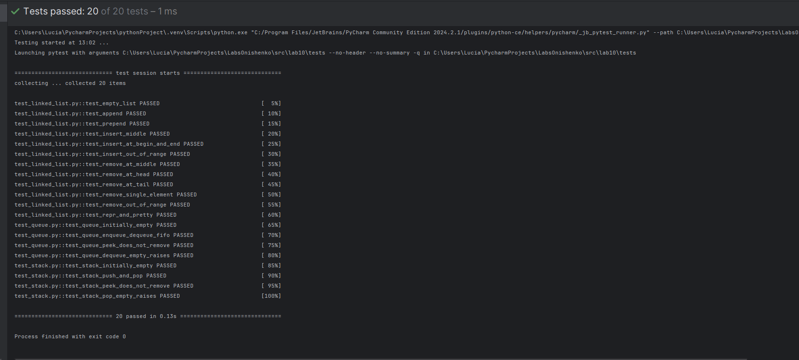

# Лабораторная работа 9
## models
```
from pathlib import Path
from src.lab08.models import Student
import csv

CSV_HEADER = ["fio", "birthdate", "group", "gpa"]


class Group:
    def __init__(self, storage_path: str):
        self.path = Path(storage_path)
        self._ensure_storage_exists()

    def _ensure_storage_exists(self):
        if not self.path.exists():
            with self.path.open("w", newline="", encoding="utf-8") as f:
                writer = csv.writer(f)
                writer.writerow(CSV_HEADER)

    def _read_all(self) -> list[Student]:
        self._ensure_storage_exists()

        with self.path.open("r", newline="", encoding="utf-8") as f:
            reader = csv.DictReader(f)

            if reader.fieldnames != CSV_HEADER:
                raise ValueError("Некорректный заголовок CSV")

            students = []
            for row in reader:
                try:
                    students.append(
                        Student(
                            fio=row["fio"],
                            birthdate=row["birthdate"],
                            group=row["group"],
                            gpa=float(row["gpa"]),
                        )
                    )
                except Exception as e:
                    raise ValueError(f"Некорректная строка CSV: {row}") from e

            return students

    def _write_all(self, students: list[Student]):
        with self.path.open("w", newline="", encoding="utf-8") as f:
            writer = csv.DictWriter(f, fieldnames=CSV_HEADER)
            writer.writeheader()
            for s in students:
                writer.writerow(
                    {
                        "fio": s.fio,
                        "birthdate": s.birthdate,
                        "group": s.group,
                        "gpa": s.gpa,
                    }
                )

    def get_list(self) -> list[Student]:
        return self._read_all()

    def add(self, student: Student):
        with self.path.open("a", newline="", encoding="utf-8") as f:
            writer = csv.DictWriter(f, fieldnames=CSV_HEADER)
            writer.writerow(
                {
                    "fio": student.fio,
                    "birthdate": student.birthdate,
                    "group": student.group,
                    "gpa": student.gpa,
                }
            )

    def find(self, substr: str) -> list[Student]:
        substr = substr.lower()
        students = self._read_all()
        return [s for s in students if substr in s.fio.lower()]

    def remove(self, fio: str):
        students = self._read_all()
        students = [s for s in students if s.fio != fio]
        self._write_all(students)

    def update(self, fio: str, **fields):
        students = self._read_all()
        updated = False

        for i, s in enumerate(students):
            if s.fio == fio:
                data = {
                    "fio": fields.get("fio", s.fio),
                    "birthdate": fields.get("birthdate", s.birthdate),
                    "group": fields.get("group", s.group),
                    "gpa": float(fields.get("gpa", s.gpa)),
                }
                students[i] = Student(**data)
                updated = True

        if not updated:
            raise ValueError(f"Студент '{fio}' не найден")

        self._write_all(students)

    def stats(self) -> dict:
        students = self._read_all()
        if not students:
            return {
                "count": 0,
                "min_gpa": None,
                "max_gpa": None,
                "avg_gpa": None,
                "groups": {},
                "top_5_students": [],
            }

        gpas = [s.gpa for s in students]

        groups: dict[str, int] = {}
        for s in students:
            groups[s.group] = groups.get(s.group, 0) + 1

        top5 = sorted(students, key=lambda s: s.gpa, reverse=True)[:5]
        top5 = [{"fio": s.fio, "gpa": s.gpa} for s in top5]

        return {
            "count": len(students),
            "min_gpa": min(gpas),
            "max_gpa": max(gpas),
            "avg_gpa": sum(gpas) / len(gpas),
            "groups": groups,
            "top_5_students": top5,
        }
```

# test_models
```python
import csv

import pytest

from src.lab08.models import Student
from src.lab09.models import Group

STUDENTS = [
    {
        "fio": "Межеровская Анна Сергеевна",
        "birthdate": "2007-11-04",
        "group": "BIVT-25-4",
        "gpa": 0.01,
    },
    {
        "fio": "Кабанова Амалия Сергеевна",
        "birthdate": "2009-01-18",
        "group": "BIVT-25-4",
        "gpa": 5.0,
    },
    {
        "fio": "Муфазалов Эрик Мансурович",
        "birthdate": "2007-08-28",
        "group": "BIVT-25-4",
        "gpa": 5.0,
    },
]


```

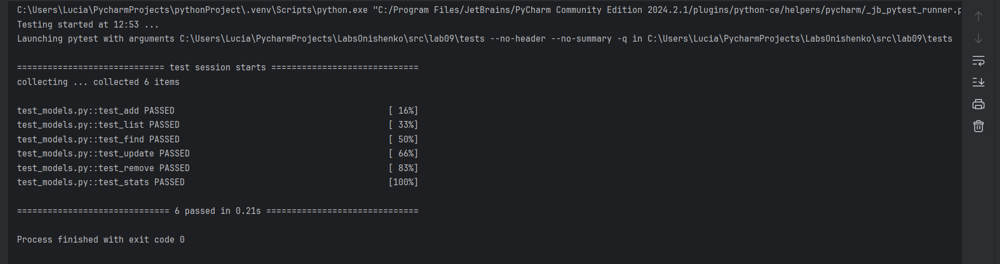

# Лабораторная работа 8
## models
```python
from dataclasses import dataclass
from datetime import date, datetime

DATE_FMT = "%Y-%m-%d"


@dataclass
class Student:
    fio: str
    birthdate: str
    group: str
    gpa: float

    def __post_init__(self):
        if not self.fio or not isinstance(self.fio, str):
            raise ValueError("ФИО обязательно и должно быть строкой")

        try:
            datetime.strptime(self.birthdate, DATE_FMT)
        except ValueError:
            raise ValueError(
                f"Дата рождения обязательна и должна быть в формате: {DATE_FMT}"
            )

        if not self.group or not isinstance(self.group, str):
            raise ValueError("Группа обязательна и должна быть строкой")

        if not isinstance(self.gpa, (float, int)):
            raise ValueError("Средний балл обязателен и должен быть числом")

        if not (0 <= float(self.gpa) <= 5):
            raise ValueError("Средний балл должен быть 0 <= и <= 5")

        self.gpa = float(self.gpa)

    def age(self) -> int:
        b = datetime.strptime(self.birthdate, DATE_FMT).date()
        today = date.today()
        full_years = today.year - b.year - ((today.month, today.day) < (b.month, b.day))
        return full_years

    def to_dict(self) -> dict:
        return {
            "fio": self.fio,
            "birthdate": self.birthdate,
            "group": self.group,
            "gpa": self.gpa,
        }

    @classmethod
    def from_dict(cls, data: dict) -> "Student":
        if not isinstance(data, dict):
            raise ValueError("Данные должны быть dict")

        required = {"fio", "birthdate", "group", "gpa"}
        missing = required - data.keys()
        if missing:
            raise ValueError(f"Лишние данные: {missing}")

        return cls(
            fio=data["fio"],
            birthdate=data["birthdate"],
            group=data["group"],
            gpa=data["gpa"],
        )

    def __str__(self):
        return f"{self.fio} ({self.group}), GPA={self.gpa}, age={self.age()}"
```

## serialize
```python
import json
from pathlib import Path

from .models import Student


def students_to_json(students: list[Student], path: str | Path) -> None:
    path = Path(path)

    data = [s.to_dict() for s in students]

    with open(path, "w", encoding="utf-8") as f:
        json.dump(data, f, ensure_ascii=False, indent=2)


def students_from_json(path: str | Path) -> list[Student]:
    path = Path(path)

    with open(path, "r", encoding="utf-8") as f:
        raw = json.load(f)

    if not isinstance(raw, list):
        raise ValueError("JSON must contain array of students")

    students = []
    for obj in raw:
        try:
            student = Student.from_dict(obj)
            students.append(student)
        except Exception as e:
            raise ValueError(f"invalid student object: {obj!r}, error: {e}") from e

    return students
```
# main
```python
from pathlib import Path

from src.lab08.models import Student
from src.lab08.serialize import students_from_json, students_to_json


def main():
    students = [
        Student(
            fio="Онищенко Светлана Николаевна",
            birthdate="2007-11-04",
            group="BIVT-25-4",
            gpa=5.00,
        ),
        Student(
            fio="Ткаченко Никита Дмитриевич",
            birthdate="2009-01-18",
            group="BIVT-25-4",
            gpa=5.0,
        ),
        Student(
            fio="Понаревская Наталия Владимировна",
            birthdate="2007-08-28",
            group="BIVT-25-4",
            gpa=5.0,
        ),
    ]

    json_path = Path("data/students.json")

    students_to_json(students, json_path)
    print(f"→ JSON сохранён в {json_path}")

    loaded_students = students_from_json(json_path)
    print("→ Загружено студентов:", len(loaded_students))

    print("\nСтуденты из JSON")
    for s in loaded_students:
        print(s)
        print()


if __name__ == "__main__":
    main()
```
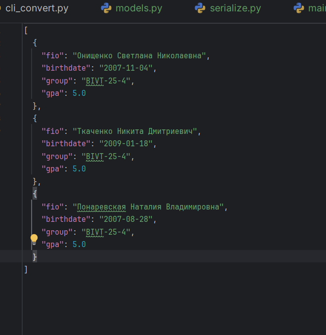
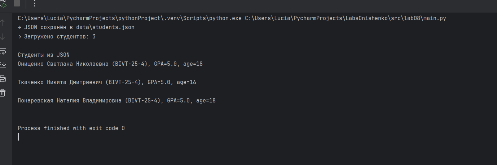


# Лабораторная работа 7
## test_json_csv
```python
import csv
import json

import pytest
import sys

sys.path.append(r'C:\Users\Lucia\PycharmProjects\LabsOnishenko\src')

from lib.convertor import csv_to_json, json_to_csv


@pytest.fixture
def json_file(tmp_path):
    json_file = tmp_path / "people.json"
    data = [
        {"name": "Alice", "age": 25, "city": "Moscow"},
    ]
    with open(json_file, "w", encoding="utf-8") as f:
        json.dump(data, f, ensure_ascii=False)
    return json_file


def test_json_to_csv(json_file, tmp_path):
    csv_output = tmp_path / "output.csv"

    json_to_csv(str(json_file), str(csv_output))

    assert csv_output.exists()

    with open(csv_output, "r", encoding="utf-8") as f:
        reader = csv.DictReader(f)
        rows = list(reader)

        assert reader.fieldnames == ["name", "age", "city"]
        assert rows[0]["name"] == "Alice"
        assert rows[0]["age"] == "25"
        assert rows[0]["city"] == "Moscow"


@pytest.fixture
def csv_file(tmp_path):
    """Фикстура создает тестовый CSV файл"""
    csv_file = tmp_path / "people.csv"
    data = [
        {"name": "Alice", "age": "25", "city": "Moscow"},
    ]
    with open(csv_file, "w", encoding="utf-8", newline="") as f:
        writer = csv.DictWriter(f, fieldnames=["name", "age", "city"])
        writer.writeheader()
        writer.writerows(data)
    return csv_file


def test_csv_to_json(csv_file, tmp_path):
    """Тест конвертации CSV в JSON"""
    json_output = tmp_path / "output.json"

    csv_to_json(str(csv_file), str(json_output))

    assert json_output.exists()

    with open(json_output, "r", encoding="utf-8") as f:
        data = json.load(f)

        assert data[0]["name"] == "Alice"
        assert data[0]["age"] == "25"
        assert data[0]["city"] == "Moscow"
```
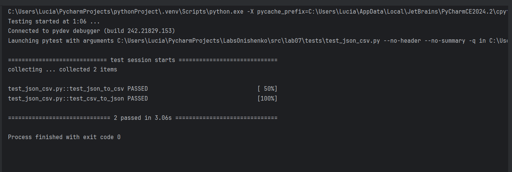
## test_text
```python
import pytest
import sys
sys.path.append(r'C:\Users\Lucia\PycharmProjects\LabsOnishenko\src')

from lib.text import count_freq, normalize, tokenize, top_n


@pytest.mark.parametrize(
    "string, expected",
    [
        ("ПрИвЕт\nМИр\t", "привет мир"),
        ("ёжик, Ёлка", "ежик, елка"),
        ("Hello\r\nWorld", "hello world"),
        ("  двойные   пробелы  ", "двойные пробелы"),
    ],
)
def test_normalize(string, expected):
    assert normalize(string) == expected


@pytest.mark.parametrize(
    "string, expected",
    [
        ("привет мир", ["привет", "мир"]),
        ("hello,world!!!", ["hello", "world"]),
        ("по-настоящему круто", ["по-настоящему", "круто"]),
        ("2025 год", ["2025", "год"]),
        ("emoji 😀 не слово", ["emoji", "не", "слово"]),
    ],
)
def test_tokenize(string, expected):
    assert tokenize(string) == expected


@pytest.mark.parametrize(
    "massive, expected",
    [
        (["a", "b", "a", "c", "b", "a"], {"a": 3, "b": 2, "c": 1}),
        (["bb", "aa", "bb", "aa", "cc"], {"aa": 2, "bb": 2, "cc": 1}),
    ],
)
def test_count_freq(massive, expected):
    assert count_freq(massive) == expected


@pytest.mark.parametrize(
    "dictionary, expected",
    [
        ({"a": 3, "b": 2, "c": 1}, [("a", 3), ("b", 2)]),
        ({"aa": 2, "bb": 2, "cc": 1}, [("aa", 2), ("bb", 2)]),
    ],
)
def test_top_n(dictionary, expected):
    assert top_n(dictionary) == expected
```

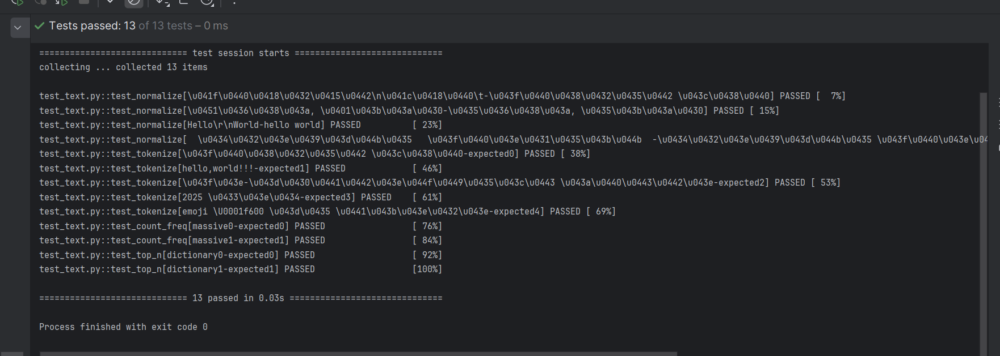


# Лабораторная работа 6
## задание A cli_text
```python
import argparse
import sys

sys.path.append(r'C:\Users\Lucia\PycharmProjects\LabsOnishenko\src')

from lib.text import normalize, tokenize, count_freq,  top_n

def read_text_file(file_path):
    try:
        with open(file_path, "r", encoding="utf-8") as f:
            return f.read()
    except FileNotFoundError:
        print(f"Ошибка: Файл {file_path} не найден")
        sys.exit(1)
    except Exception as e:
        print(f"Ошибка при чтении файла: {e}")
        sys.exit(1)

def cat_command(args):
    try:
        with open(args.input, "r", encoding="utf-8") as f:
            for line_num, line in enumerate(f, 1):
                if args.n:
                    print(f"{line_num:6} {line}", end="")
                else:
                    print(line, end="")
    except FileNotFoundError:
        print(f"Ошибка: Файл {args.input} не найден")
        sys.exit(1)
    except Exception as e:
        print(f"Ошибка при чтении файла: {e}")
        sys.exit(1)


def stats_command(args):
    text = read_text_file(args.input)
    normalize_text = normalize(text)
    tokens = tokenize(normalize_text)
    frequencies = count_freq(tokens)
    top_5 = top_n(frequencies, args.top)

    print("Топ-5:")

    for item in top_5:
        print(f"{item[0]}: {item[1]}")


def main():
    parser = argparse.ArgumentParser(
        description="CLI-утилиты для работы с текстом"
    )
    subparsers = parser.add_subparsers(dest="command", help="Доступные команды")

    cat_parser = subparsers.add_parser("cat", help="Вывести содержимое файла")
    cat_parser.add_argument("--input", required=True, help="Путь к входному файлу")
    cat_parser.add_argument("-n", action="store_true", help="Нумеровать строки")

    stats_parser = subparsers.add_parser("stats", help="Анализ частот слов")
    stats_parser.add_argument("--input", required=True, help="Путь к текстовому файлу")
    stats_parser.add_argument("--top", type=int, default=5, help="Количество топ-слов (по умолчанию: 5)")

    args = parser.parse_args()


    if args.command == "cat":
        cat_command(args)
    elif args.command == "stats":
        stats_command(args)
    else:
        parser.print_help()


if __name__ == "__main__":
    main()
```
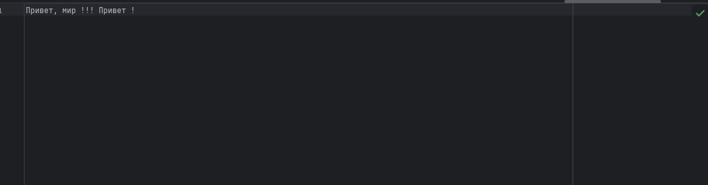
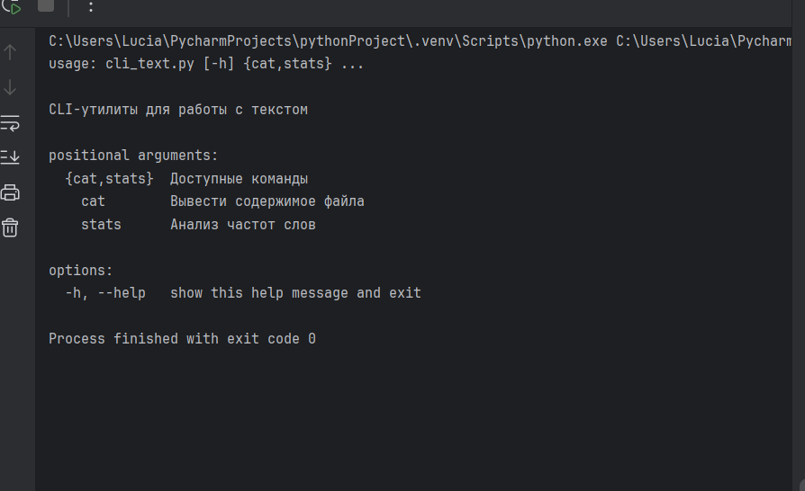
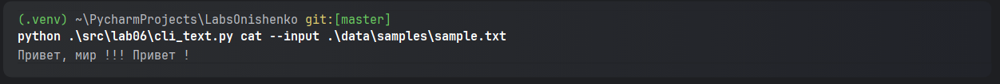
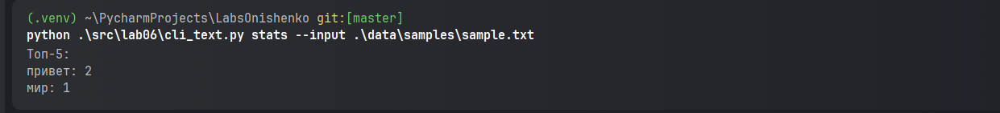
## задание В cli_convert
```python
import argparse
import sys

sys.path.append(r'C:\Users\Lucia\PycharmProjects\LabsOnishenko\src')

from lib.convertor import csv_to_json, csv_to_xlsx, json_to_csv


def json2csv_command(args):
    try:
        json_to_csv(args.infile, args.out)
        print(f"Успешно конвертировано: {args.infile} -> {args.out}")
    except Exception as e:
        print(f"Ошибка при конвертации JSON в CSV: {e}")
        sys.exit(1)


def csv2json_command(args):
    try:
        csv_to_json(args.infile, args.out)
        print(f"Успешно конвертировано: {args.infile} -> {args.out}")
    except Exception as e:
        print(f"Ошибка при конвертации CSV в JSON: {e}")
        sys.exit(1)


def csv2xlsx_command(args):
    try:
        csv_to_xlsx(args.infile, args.out)
        print(f"Успешно конвертировано: {args.infile} -> {args.out}")
    except Exception as e:
        print(f"Ошибка при конвертации CSV в XLSX: {e}")
        sys.exit(1)


def main():
    parser = argparse.ArgumentParser(description="Конвертер между форматами данных")

    subparsers = parser.add_subparsers(dest="command", help="Доступные команды")

    json2csv_parser = subparsers.add_parser("json2csv", help="Конвертация JSON в CSV")
    json2csv_parser.add_argument(
        "--input", dest="infile", required=True, help="Входной JSON файл"
    )
    json2csv_parser.add_argument("--out", required=True, help="Выходной CSV файл")

    csv2json_parser = subparsers.add_parser("csv2json", help="Конвертация CSV в JSON")
    csv2json_parser.add_argument(
        "--input", dest="infile", required=True, help="Входной CSV файл"
    )
    csv2json_parser.add_argument("--out", required=True, help="Выходной JSON файл")

    csv2xlsx_parser = subparsers.add_parser("csv2xlsx", help="Конвертация CSV в XLSX")
    csv2xlsx_parser.add_argument(
        "--input", dest="infile", required=True, help="Входной CSV файл"
    )
    csv2xlsx_parser.add_argument("--out", required=True, help="Выходной XLSX файл")

    args = parser.parse_args()

    if args.command == "json2csv":
        json2csv_command(args)
    elif args.command == "csv2json":
        csv2json_command(args)
    elif args.command == "csv2xlsx":
        csv2xlsx_command(args)
    else:
        parser.print_help()


if __name__ == "__main__":
    main()
```

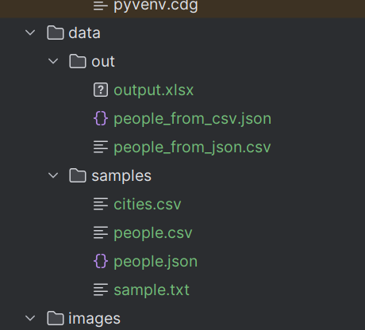
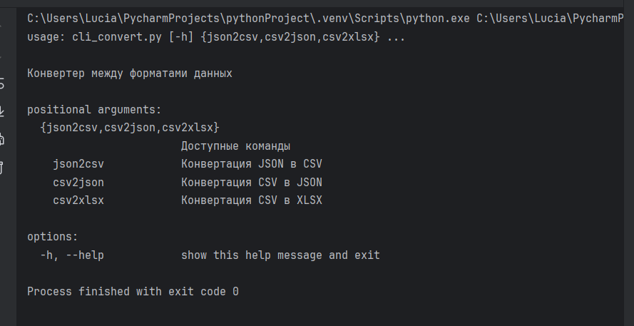
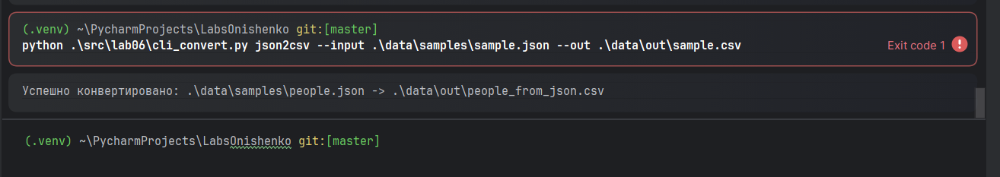
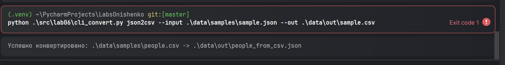
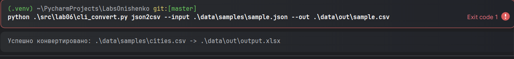


# Лабораторная работа 5
## задание A JSON_CSV
```python
import json
import csv
import os
from typing import List, Dict, Any


def validate_json_file(json_path: str) -> List[Dict[str, Any]]:
    if not os.path.exists(json_path):
        raise FileNotFoundError(f"JSON файл не найден: {json_path}")
    if os.path.getsize(json_path) == 0:
        raise ValueError(f"JSON файл пустой: {json_path}")
    with open(json_path, 'r', encoding='utf-8') as json_file:
        data = json.load(json_file)
    if not isinstance(data, list):
        raise ValueError(f"JSON должен содержать список на верхнем уровне. Получен: {type(data)}")

    if len(data) == 0:
        raise ValueError(f"JSON файл содержит пустой список: {json_path}")

    if not all(isinstance(item, dict) for item in data):
        raise ValueError("Все элементы JSON должны быть словарями")

    return data


def validate_csv_file(csv_path: str) -> List[str]:
    if not os.path.exists(csv_path):
        raise FileNotFoundError(f"CSV файл не найден: {csv_path}")

    if os.path.getsize(csv_path) == 0:
        raise ValueError(f"CSV файл пустой: {csv_path}")

    with open(csv_path, 'r', encoding='utf-8') as csv_file:
        reader = csv.reader(csv_file)
        headers = next(reader, None)

        if headers is None:
            raise ValueError(f"CSV файл не содержит заголовков: {csv_path}")

        if not headers:
            raise ValueError(f"CSV файл содержит пустые заголовки: {csv_path}")

    return headers


def json_to_csv(json_path: str, csv_path: str) -> None:
    data = validate_json_file(json_path)
    output_dir = os.path.dirname(csv_path)
    if output_dir:
        os.makedirs(output_dir, exist_ok=True)

    all_keys = set()
    for item in data:
        all_keys.update(item.keys())

    fieldnames = sorted(all_keys)

    with open(csv_path, 'w', encoding='utf-8', newline='') as csv_file:
        writer = csv.DictWriter(csv_file, fieldnames=fieldnames)

        writer.writeheader()

        for item in data:
            row = {key: str(item.get(key, '')) for key in fieldnames}
            writer.writerow(row)


def csv_to_json(csv_path: str, json_path: str) -> None:
    validate_csv_file(csv_path)

    output_dir = os.path.dirname(json_path)
    if output_dir:
        os.makedirs(output_dir, exist_ok=True)

    data = []

    with open(csv_path, 'r', encoding='utf-8') as file:
        reader = csv.DictReader(file)

        for row in reader:
            data.append(dict(row))

    with open(json_path, 'w', encoding='utf-8') as file:
        json.dump(data, file, ensure_ascii=False, indent=2)


if __name__ == "__main__":
    samples_path = 'data/samples'
    out_path = 'data/out'

    test_cases = [
        (json_to_csv, f'{samples_path}/people.json', f'{out_path}/people_from_json.csv', "Нормальный JSON → CSV"),
        (csv_to_json, f'{samples_path}/people.csv', f'{out_path}/people_from_csv.json', "Нормальный CSV → JSON"),
    ]

    os.makedirs(out_path, exist_ok=True)

    for func, input_file, output_file, description in test_cases:

        try:
            func(input_file, output_file)
        except FileNotFoundError:
            print("FileNotFoundError")
        except ValueError:
            print("ValueError")

    try:
        print("JSON -> CSV")
        json_to_csv(f'{samples_path}/people.json', f'{out_path}/people_from_json.csv')

        print("CSV -> JSON")
        csv_to_json(f'{samples_path}/people.csv', f'{out_path}/people_from_csv.json')

    except FileNotFoundError:
        print("FileNotFoundError")
    except ValueError:
        print("ValueError")
    finally:
        print("Успешно")
```


## задание В CSV_XLSX
```python
import csv
import os
from pathlib import Path
from openpyxl import Workbook
from openpyxl.utils import get_column_letter


def csv_to_xlsx(csv_path: str, xlsx_path: str) -> None:
    if not os.path.exists(csv_path):
        raise FileNotFoundError(f"Файл не найден: {csv_path}")

    if os.path.getsize(csv_path) == 0:
        raise ValueError("CSV файл пуст")

    workbook = Workbook()
    sheet = workbook.active
    sheet.title = "Sheet1"

    with open(csv_path, 'r', encoding='utf-8') as file:
        csv_reader = csv.reader(file)
        rows = list(csv_reader)

    if not rows:
        raise ValueError("CSV файл не содержит данных")

    for row_idx, row in enumerate(rows, 1):
        for col_idx, value in enumerate(row, 1):
            sheet.cell(row=row_idx, column=col_idx, value=value)

    for column_cells in sheet.columns:
        max_length = 0
        column_letter = get_column_letter(column_cells[0].column)

        for cell in column_cells:
            try:
                if cell.value:
                    max_length = max(max_length, len(str(cell.value)))
            except:
                pass

        adjusted_width = max(max_length + 2, 8)
        sheet.column_dimensions[column_letter].width = adjusted_width

    workbook.save(xlsx_path)


if __name__ == "__main__":
    try:
        csv_path = Path("data/samples/cities.csv")
        xslx_path = Path("data/out/output.xlsx")
        csv_to_xlsx(csv_path, xslx_path)
        print("Успешно")
    except (ValueError, FileNotFoundError) as e:
        print(f"Ошибка: {e}")
```


# Лабораторная работа 4
## io_txt_csv.py
```python
from pathlib import Path
import csv


def read_text(path, encoding="utf-8"):
    path = Path(path)

    with open(path, "r", encoding=encoding) as file:
        return file.read()


def write_csv(
    rows,
    path,
    header=None,
):
    path = Path(path)

    if rows:
        first_length = len(rows[0])
        for row in rows:
            if len(row) != first_length:
                raise ValueError(
                    f"Строка имеет длину {len(row)}, ожидалось {first_length}"
                )

    if header and rows:
        if len(header) != len(rows[0]):
            raise ValueError(
                f"Заголовок имеет длину {len(header)}, а строки - {len(rows[0])}"
            )

    ensure_parent_dir(path)

    with open(path, "w", newline="", encoding="utf-8") as file:
        writer = csv.writer(file, delimiter=",")

        if header:
            writer.writerow(header)

        writer.writerows(rows)


def ensure_parent_dir(path):
    path = Path(path)
    parent_dir = path.parent
    parent_dir.mkdir(parents=True, exist_ok=True)


try:
    content = read_text("src/lab04/data/input.txt", encoding="utf-8")
    print(content)
except FileNotFoundError:
    print("FileNotFoundError: Файл не найден")
except UnicodeDecodeError:
    print("UnicodeDecodeError: Ошибка кодировки")

write_csv([("test", 3)], "src/lab04/output/check.csv", header=("word", "count"))

print("=== ПРОВЕРКА ПУТЕЙ ===")
print(f"Текущая директория: {Path.cwd()}")

input_path = Path("src/lab04/data/input.txt")
print(f"Путь к input.txt: {input_path}")
print(f"Файл существует: {input_path.exists()}")

# Проверяем чтение
try:
    content = read_text("src/lab04/data/input.txt", encoding="utf-8")
    print("Файл найден! Содержимое:")
    print(content)
except FileNotFoundError:
    print("FileNotFoundError: Файл не найден")

    # Создаем тестовый файл
    print("Создаю тестовый файл...")
    ensure_parent_dir(input_path)
    with open(input_path, "w", encoding="utf-8") as f:
        f.write("Привет, мир, привет !!!\n")
    print(f"Файл создан: {input_path}")


```


## text_report
```python
import sys
import os
from pathlib import Path

sys.path.insert(0, os.path.dirname(os.path.dirname(os.path.dirname(__file__))))

import sys
sys.path.append(r'C:\Users\Lucia\PycharmProjects\LabsOnishenko\src')

from lib.text import normalize, tokenize, count_freq, top_n

def read_input_file(file_path):
    if not file_path.exists():
        raise FileNotFoundError(f"Входной файл не найден: {file_path}")

    with open(file_path, "r", encoding="utf-8") as file:
        return file.read()


def write_report_csv(frequencies, output_path):
    sorted_items = sorted(frequencies.items(), key=lambda x: (-x[1], x[0]))

    with open(output_path, "w", encoding="utf-8") as file:
        file.write("word,count\n")

        for word, count in sorted_items:
            file.write(f"{word},{count}\n")


def print_summary(tokens, frequencies, top_n):
    print(f"Всего слов: {len(tokens)}")
    print(f"Уникальных слов: {len(frequencies)}")
    print("Топ-5:")

    for word, count in (top_n, 1):
        print(f"{word}: {count}")


def main():
    input_path = Path("src/lab04/data/input.txt")
    output_path = Path("src/lab04/output/report.csv")

    try:
        text = read_input_file(input_path)

        normalized_text = normalize(text)
        tokens = tokenize(normalized_text)
        frequencies = count_freq(tokens)
        top_5 = top_n(frequencies, 5)

        write_report_csv(frequencies, output_path)

        print_summary(tokens, frequencies, top_5)

    except FileNotFoundError as e:
        print(f"Ошибка: {e}")
        print("Убедитесь, что файл data/input.txt существует")
        sys.exit(1)
    except Exception as e:
        print(f"Неожиданная ошибка: {e}")
        sys.exit(1)


if __name__ == "__main__":
    main()
```


# Лабораторная работа 3
## Задание А функция 1
```python
import re
text = '  двойные   пробелы  '
def normalize(text: str, *, casefold: bool = True, yo2e: bool = True) -> str:
    if casefold:
        text = text.casefold()
    if yo2e:
        text = text.replace("ё","е").replace("Ё","Е")
    text = text.replace("\r"," ").replace("\t"," ")
    text = text.strip()
    text = text.split()
    text = " ".join(text)
    return text
text1 = normalize(text)
print(text1)
```
## Тест-кейсы к 1 функции


## Задание А функция 2
```python
import re
text1="emoji 😀 не слово"
def tokenize(text: str) -> list[str]:
    return re.findall("[\w-]+", text)
text2 = tokenize(text1)
print(text2)
```
## Тест-кейсы ко 2 функции


## Задание A функции 3-4
```python
text2 = ["bb","aa","bb","aa","cc"]


def count_freq(tokens: list[str]) -> dict[str, int]:
    result = {}
    for token in tokens:
        result[token] = result.get(token, 0) + 1
    return result


text3 = count_freq(text2)


def top_n(freq: dict[str, int], n: int = 5) -> list[tuple[str, int]]:
    result = []
    for key in freq:
        value = freq[key]
        element = (key, value)
        result.append(element)


    result = sorted(result, key=lambda p: p[0])[:n]

    return result


text4 = top_n(text3)
print(text4)
print(input())

```
## Тест-кейсы к функциям 3-4


## Задание В
```python
import sys
import io

# Принудительная настройка кодировки для Windows PowerShell для Кириллицы
if sys.platform == "win32":
    sys.stdin = io.TextIOWrapper(sys.stdin.buffer, encoding='utf-8')

import sys
sys.path.append(r'C:\Users\Lucia\PycharmProjects\LabsOnishenko\src')

from lib.text import normalize, tokenize, count_freq, top_n
import re

a = sys.stdin.read().strip()
norm = normalize(a)
token = tokenize(norm)
print("Всего слов:", len(token))
count = count_freq(token)
print("Уникальных слов:", len(count))
top = top_n(count)
print("Топ-5:")

for element in top[:5]:  
    print(element[0], ":", element[1])
```


# Лабораторная работа 2


## Задание 1 пункт 3
```python
mat = [[1, 2], [3, 4]]
def flatten(mat):
    new_mat = []
    for num in mat:
        if type(num) == tuple or type(num) == list:
            for i in range(len(num)):
                if num[i] != '':
                    new_mat.append(num[i])
        else:
            raise ValueError
    print(new_mat)
flatten(mat)
```


## Задание B пункт 1
```python
mat= [[1, 2], [3, 4]]

def check_rvanost(mat):
    dlina = len(mat[-1])
    for x in mat:
        if len(x) != dlina:
            raise ValueError
        else:
            return True
def transpose(mat):
    if check_rvanost:
        new_mat = []
        for stolbec in range(len(mat[-1])):
            new_row = []
            for row in range(len(mat)):
                new_row.append(mat[row][stolbec])
            new_mat.append(new_row)
    print(new_mat)
transpose(mat)
```


## Задание B пункт 2
```python
mat = [[1, 2], [3, 4]]
def check_rvanost(mat):
    for i in range(len(mat)):
        if len(mat[i]) == len(mat[i+1]):
            return True
        else:
            return False
def row_sums(mat):
    new_mat = []
    for x in mat:
        if type(x) == list and check_rvanost(mat):
            summa = 0
            for i in range(len(x)):
                summa += x[i]
            new_mat.append(summa)
        else:
            raise ValueError
    print(new_mat)
row_sums(mat)
```


## Задание B пункт 3
```python
mat = [[1, 2, 3], [4, 5, 6]]# Лабораторная работа 2
## Задание 1 пункт 1
```python
nums = [1,2,3,4]
def min_max(nums):
    a = []
    if len(nums) > 0:
        minn = a.append(min(nums))
        maxx = a.append(max(nums))
        print(tuple(a))
    else:
        raise ValueError
min_max(nums)
```


## Задание 1 пункт 2
```python
nums = [3,1,2,1,3]
def unique_sorted(nums):
    new_nums = sorted(set(nums))
    print(new_nums)
unique_sorted(nums)

```


## Задание 1 пункт 3
```python
mat = [[1, 2], [3, 4]]
def flatten(mat):
    new_mat = []
    for num in mat:
        if type(num) == tuple or type(num) == list:
            for i in range(len(num)):
                if num[i] != '':
                    new_mat.append(num[i])
        else:
            raise ValueError
    print(new_mat)
flatten(mat)
```


## Задание B пункт 1
```python
mat= [[1, 2], [3, 4]]

def check_rvanost(mat):
    dlina = len(mat[-1])
    for x in mat:
        if len(x) != dlina:
            raise ValueError
        else:
            return True
def transpose(mat):
    if check_rvanost:
        new_mat = []
        for stolbec in range(len(mat[-1])):
            new_row = []
            for row in range(len(mat)):
                new_row.append(mat[row][stolbec])
            new_mat.append(new_row)
    print(new_mat)
transpose(mat)
```


## Задание B пункт 2
```python
mat = [[1, 2], [3, 4]]
def check_rvanost(mat):
    for i in range(len(mat)):
        if len(mat[i]) == len(mat[i+1]):
            return True
        else:
            return False
def row_sums(mat):
    new_mat = []
    for x in mat:
        if type(x) == list and check_rvanost(mat):
            summa = 0
            for i in range(len(x)):
                summa += x[i]
            new_mat.append(summa)
        else:
            raise ValueError
    print(new_mat)
row_sums(mat)
```


## Задание B пункт 3
```python
mat = [[1, 2, 3], [4, 5, 6]]
def col_sums(mat):
    result = []
    max_length_row = max([len(row) for row in mat])

    try:
        for i in range(max_length_row):
            count = 0
            for row in mat:
                count += row[i]
            result.append(count)
    except:
        raise ValueError("рваная")
    return result
print(col_sums(mat))
```


## Задание C
```python
rec = ("сидорова  анна сергеевна", "ABB-01", 3.999)

def fio(res):
    part = rec[0].split()
    if not part:
        raise ValueError("FIO is empty")
    init = ''.join(l[0].upper() for l in part[1:])
    surn = part[0][0].upper() + part[0][1:]
    return f"{surn} {'.'.join(init)}."

def gpa(rec):
    gp = rec[2]
    if not gp:
        raise ValueError("GPA is empty")
    else:
        return round(rec[2], 2)


def formatRec(rec):
    if len(rec) != 3:
        raise ValueError("Wrong data")
    else:
        name = fio(rec)
        gr = rec[1]
        if not gr:
            raise ValueError("Group is empty")
        gp = gpa(rec)
        print(f"{name}, гр. {gr}, GPA: {gp}")

formatRec(rec)
```


# Лабораторная работа 1
## №1
```python
a = input('')
b = int(input(''))
c = b + 1
print('Имя:', a)
print('Возраст:',b)
print('Привет,',a,'! Через год тебе будет', c, '.')
```


## №2
```python
a = input("a: ").replace(',', '.')
b = input("b: ").replace(',', '.')
c = float(a)
d = float(b)
sum_result = c + d
avg_result = (c + d) / 2
print(f"sum={sum_result:.2f}; avg={avg_result:.2f}")
```


## №3
```python
price = int(input())
discount = int(input())
vat = int(input())
base = price * (1 - discount/100)
vat_amount = base * (vat/100)
total = base + vat_amount
print('База после скидки:',base)
print('НДС',vat_amount)
print('Итого к оплате:',total)
```


## №4
```python
a = int(input('Минуты:'))
b = a//60
c = a % 60
print(b,':',c)
```


## №5
```python
a = input("ФИО: ").strip()
b = ' '.join(a.split())
c = ''.join(word[0].upper() for word in b.split())
d = len(b)
print("Инициалы:",c)
print("Длина (символов):",d)
```

